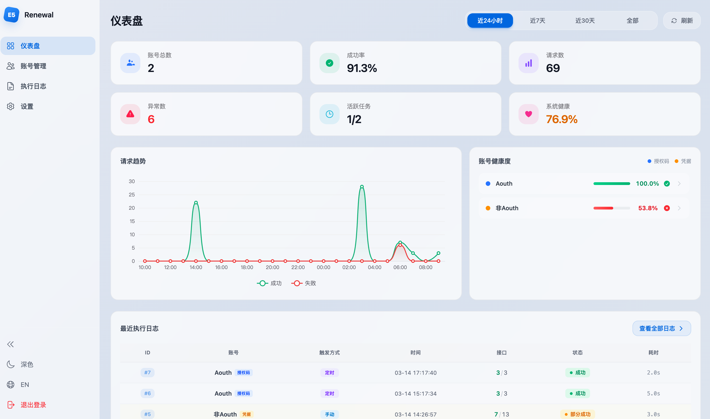
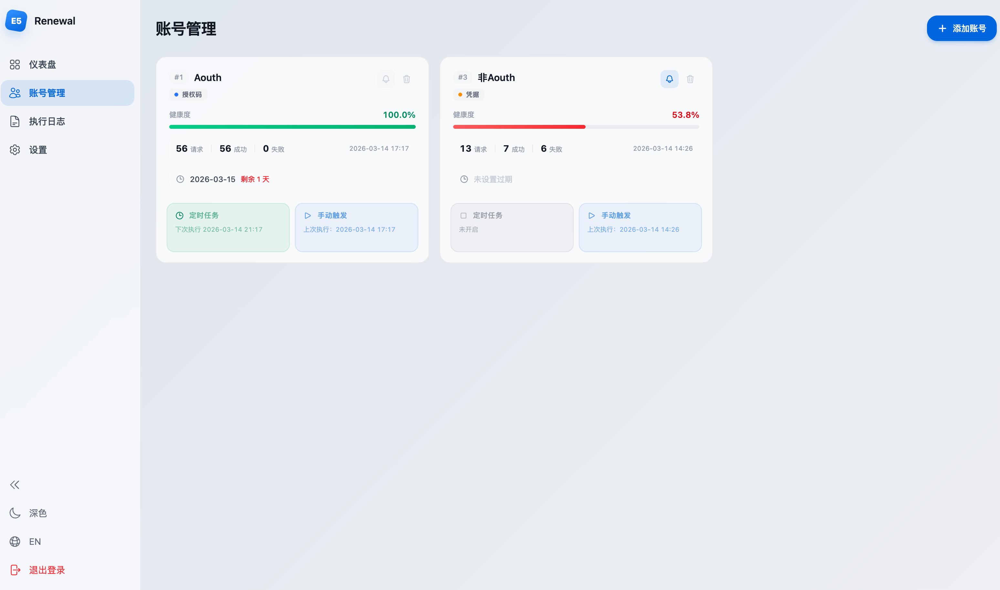
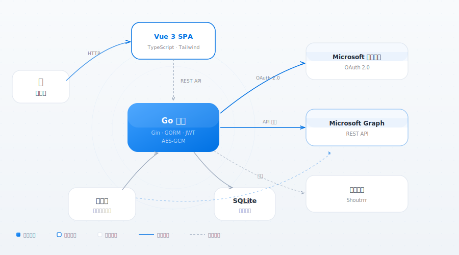

<p align="center">
  
</p>
<h1 align="center">E5 Renewal</h1>
<p align="center">
  一个自托管的 Microsoft 365 E5 开发者订阅自动续期工具，通过定时调用随机 Graph API 保持订阅活跃。
</p>

<p align="center">
  <a href="https://github.com/cnzakii/e5-renewal/blob/main/LICENSE"></a>
  <a href="https://github.com/cnzakii/e5-renewal"></a>
  <a href="https://github.com/cnzakii/e5-renewal/releases"></a>
  <a href="https://github.com/cnzakii/e5-renewal/actions"></a>
  <a href="https://github.com/cnzakii/e5-renewal/commits"></a>
</p>

<p align="center">
  <a href="README_EN.md">English</a>
</p>

---

## 功能特性

- **自动调度** — 可配置的随机间隔 Graph API 调用，支持仿真时间模式
- **多账户管理** — 支持多个 E5 账户独立调度
- **OAuth 2.0** — 内置授权码流程，方便获取令牌
- **健康监控** — 每账户健康评分，失败率超阈值自动暂停
- **推送通知** — 授权过期、任务失败、健康度低时通过 [Shoutrrr](https://containrrr.dev/shoutrrr/) 发送通知
- **仪表盘** — 可视化概览，包含趋势图表和执行日志
- **双语界面** — 支持中文和英文
- **极致轻量** — 前端嵌入 Go 二进制，单个 Docker 镜像（~30MB），运行内存仅 ~27MB

## 界面预览

<p align="center">
  
</p>
<p align="center">
  
</p>

## 架构

<p align="center">
  
</p>

## 快速开始

### 前置步骤

需要先注册 Azure 应用，详细步骤请参考[这篇教程](https://ednovas.xyz/2022/01/10/e5renewplus/#1-%E6%B3%A8%E5%86%8CAzure%E5%BA%94%E7%94%A8%E7%A8%8B%E5%BA%8F)。

### Docker 部署

```bash
docker run -d \
  --name e5-renewal \
  -p 8080:8080 \
  -v ./data:/data \
  -e E5_JWT_SECRET=$(openssl rand -hex 32) \
  -e E5_ENCRYPTION_KEY=$(openssl rand -hex 16) \
  ghcr.io/cnzakii/e5-renewal:latest
```

首次启动时，登录密钥会自动生成并打印在日志中：

```bash
docker logs e5-renewal
# 查找: login key generated  key=xxxxxxxx-xxxx-xxxx-xxxx-xxxxxxxxxxxx
```

## 配置说明

支持环境变量或 YAML 配置文件，环境变量优先级更高。

配置文件查找顺序：`E5_CONFIG` 环境变量 → 工作目录下的 `config.yaml` / `config.yml` / `config.json`。模板参考 [`e5-renewal.yaml.example`](e5-renewal.yaml.example)。

| 变量 | 必填 | 默认值 | 说明 |
|------|------|--------|------|
| `E5_CONFIG` | 否 | 自动检测 | 配置文件路径（如 `/data/config.yaml`） |
| `E5_JWT_SECRET` | 是 | — | JWT 签名密钥（建议使用 64 位随机十六进制字符串） |
| `E5_ENCRYPTION_KEY` | 是 | — | AES 加密密钥，用于加密存储的敏感信息（设置后不可更改） |
| `E5_LOGIN_KEY` | 否 | 自动生成 | 管理员登录密码 |
| `E5_DB_PATH` | 否 | `data/e5.db` | SQLite 数据库文件路径 |
| `E5_PATH_PREFIX` | 否 | — | URL 路径前缀（如 `/myapp`） |
| `E5_PORT` | 否 | `8080` | 监听端口 |
| `E5_TLS_CERT` | 否 | — | TLS 证书文件路径 |
| `E5_TLS_KEY` | 否 | — | TLS 私钥文件路径 |

## Docker Compose

```yaml
services:
  e5-renewal:
    image: ghcr.io/cnzakii/e5-renewal:latest
    restart: unless-stopped
    ports:
      - "8080:8080"
    volumes:
      - ./data:/data
    env_file:
      - .env
```

## 开发

**前置要求：** Go 1.25+、Node.js 22+

```bash
# 后端
cd backend
go test -race ./...
golangci-lint run

# 前端
cd frontend
npm ci
npm run dev
npx vitest run

# 构建 Docker 镜像
docker build -t e5-renewal:latest .
```

## 许可证

[MIT](LICENSE)
