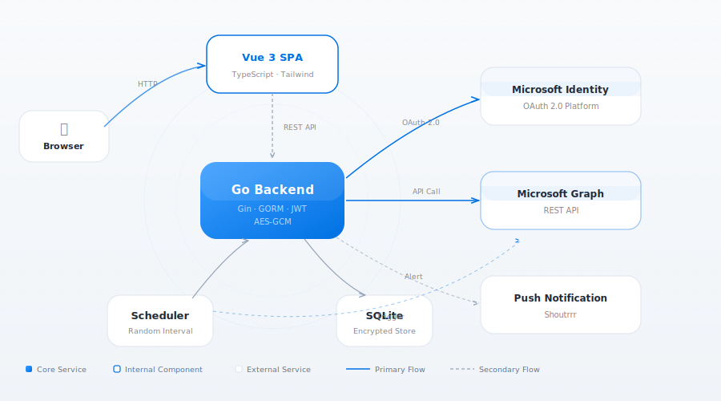

<p align="center">
  
</p>
<h1 align="center">E5 Renewal</h1>
<p align="center">
  A self-hosted tool that automatically renews Microsoft 365 E5 developer subscriptions by scheduling randomized Graph API calls.
</p>

<p align="center">
  <a href="https://github.com/cnzakii/e5-renewal/blob/main/LICENSE"></a>
  <a href="https://github.com/cnzakii/e5-renewal"></a>
  <a href="https://github.com/cnzakii/e5-renewal/releases"></a>
  <a href="https://github.com/cnzakii/e5-renewal/actions"></a>
  <a href="https://github.com/cnzakii/e5-renewal/commits"></a>
</p>

<p align="center">
  <a href="README.md">中文文档</a>
</p>

---

## Features

- **Automated Scheduling** — Configurable random-interval Graph API calls with realistic timing simulation
- **Multi-Account** — Manage multiple E5 accounts with independent schedules
- **OAuth 2.0** — Built-in authorization code flow for easy token setup
- **Health Monitoring** — Per-account health scores with auto-pause on failure threshold
- **Push Notifications** — Alerts for auth expiry, task failures, and low health via [Shoutrrr](https://containrrr.dev/shoutrrr/)
- **Dashboard** — Visual overview with trend charts and execution logs
- **Bilingual UI** — Chinese and English interface
- **Single Binary** — Frontend embedded in Go binary, single Docker image (~30MB), runtime memory ~27MB

## Screenshots

<p align="center">
  
</p>
<p align="center">
  
</p>

## Architecture

<p align="center">
  
</p>

## Quick Start

### Prerequisites

You need to register an Azure application first. See [this guide](https://ednovas.xyz/2022/01/10/e5renewplus/#1-%E6%B3%A8%E5%86%8CAzure%E5%BA%94%E7%94%A8%E7%A8%8B%E5%BA%8F) for detailed steps.

### Docker

```bash
docker run -d \
  --name e5-renewal \
  -p 8080:8080 \
  -v ./data:/data \
  -e E5_JWT_SECRET=$(openssl rand -hex 32) \
  -e E5_ENCRYPTION_KEY=$(openssl rand -hex 16) \
  ghcr.io/cnzakii/e5-renewal:latest
```

The login key will be auto-generated and printed in logs on first start:

```bash
docker logs e5-renewal
# Look for: login key generated  key=xxxxxxxx-xxxx-xxxx-xxxx-xxxxxxxxxxxx
```

## Configuration

Configuration can be provided via environment variables or a YAML config file. Environment variables take precedence.

The config file is resolved in order: `E5_CONFIG` env → `config.yaml` / `config.yml` / `config.json` in the working directory. See [`e5-renewal.yaml.example`](e5-renewal.yaml.example) for a template.

| Variable | Required | Default | Description |
|----------|----------|---------|-------------|
| `E5_CONFIG` | No | auto-detect | Config file path (e.g., `/data/config.yaml`) |
| `E5_JWT_SECRET` | Yes | — | JWT signing secret (use a random 64-char hex string) |
| `E5_ENCRYPTION_KEY` | Yes | — | AES encryption key for secrets at rest (cannot be changed once set) |
| `E5_LOGIN_KEY` | No | auto-generated | Admin login password |
| `E5_DB_PATH` | No | `data/e5.db` | SQLite database file path |
| `E5_PATH_PREFIX` | No | — | URL path prefix (e.g., `/myapp`) |
| `E5_PORT` | No | `8080` | Listen port |
| `E5_TLS_CERT` | No | — | TLS certificate file path |
| `E5_TLS_KEY` | No | — | TLS private key file path |

## Docker Compose

```yaml
services:
  e5-renewal:
    image: ghcr.io/cnzakii/e5-renewal:latest
    restart: unless-stopped
    ports:
      - "8080:8080"
    volumes:
      - ./data:/data
    env_file:
      - .env
```

## Development

**Prerequisites:** Go 1.25+, Node.js 22+

```bash
# Backend
cd backend
go test -race ./...
golangci-lint run

# Frontend
cd frontend
npm ci
npm run dev
npx vitest run

# Build Docker image
docker build -t e5-renewal:latest .
```

## License

[MIT](LICENSE)
